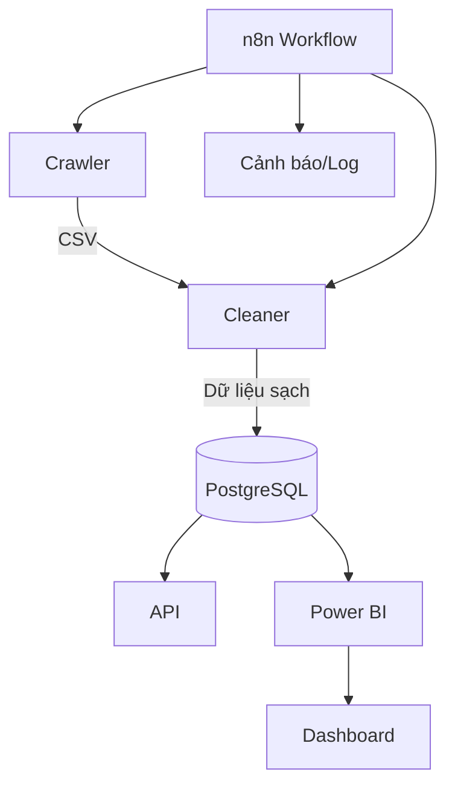

# 🌏 Vietnam Environmental Data Platform


## 📌 Giới thiệu

Nền tảng dữ liệu môi trường Việt Nam thu thập, làm sạch, chuẩn hóa, lưu trữ và cung cấp API dữ liệu không khí, nước, đất, khí hậu từ nhiều nguồn (OpenWeather, SoilGrids, NASA POWER, World Bank, ...). Hệ thống hỗ trợ workflow tự động (n8n), cảnh báo Discord, tích hợp BI, triển khai đa môi trường (local, cloud, Docker).

---

## 🗺️ Sơ đồ luồng dữ liệu



---

## 🧩 Chi tiết các module

### 1. Crawler
- Thu thập dữ liệu từ nhiều nguồn (OpenWeather, SoilGrids, NASA POWER, World Bank...)
- Hỗ trợ crawl song song, cache, retry, log chi tiết
- Đầu ra: file CSV lưu tại `data_storage/<type>/raw/`

### 2. Cleaner
- Nhận file CSV, làm sạch, chuẩn hóa, phân tách bảng (City, Source, WeatherCondition...)
- Mapping ID, kiểm tra ngoại lệ, log chi tiết
- Lưu dữ liệu sạch vào PostgreSQL

### 3. API
- Cung cấp REST API cho dashboard, phân tích, cảnh báo, truy vấn dữ liệu sạch
- Endpoint phân tích, sinh cảnh báo nếu vượt ngưỡng

### 4. Workflow tự động (n8n)
- n8n điều phối, lên lịch, gọi các API, gửi cảnh báo Discord, log thực thi, trigger Power BI

---

## 📦 Ví dụ sử dụng API

### Lấy dữ liệu chất lượng không khí mới nhất
```bash
curl http://localhost:8000/air-quality
```

### Gửi dữ liệu để phân tích/cảnh báo
```bash
curl -X POST http://localhost:8000/process-data -H "Content-Type: application/json" -d '{"city": "Hanoi", "pm25": 80}'
```

### Chạy crawl dữ liệu không khí
```bash
curl -X POST http://localhost:8081/run_crawl
```

## �🧱 Cấu trúc dự án

```
├── Air_Quality/
│   ├── api/
│   │   ├── api.py
│   │   ├── routes/
│   │   │   └── process.py
│   │   └── utils/
│   │       └── db.py
│   ├── Cleaners/
│   │   ├── __init__.py
│   │   ├── air_cleaner.py
│   │   ├── climate_cleaner.py
│   │   ├── main_cleaner.py
│   │   ├── soil_cleaner.py
│   │   └── water_cleaner.py
│   ├── config/
│   │   └── locations_vietnam.json
│   ├── configs/
│   │   ├── locations_vietnam.json
│   │   └── requirements.txt
│   ├── crawlers/
│   │   ├── air/
│   │   │   └── air_crawler.py
│   │   ├── climate/
│   │   │   └── climate_crawler.py
│   │   ├── soil/
│   │   │   └── soil_crawler.py
│   │   └── water/
│   │       ├── locations_vietnam.json
│   │       └── water_crawler.py
│   ├── data_cleaner/
│   │   └── data/
│   │       ├── cleaned_air_quality.csv
│   │       └── data_tranform/
│   │           ├── AirQualityRecord.csv
│   │           ├── City.csv
│   │           ├── Source.csv
│   │           └── WeatherCondition.csv
│   ├── data_storage/
│   │   ├── air/
│   │   │   ├── cleaned_air_quality.csv
│   │   │   ├── data_tranform/
│   │   │   └── raw/
│   │   ├── climate/
│   │   │   └── raw/
│   │   ├── soil/
│   │   │   ├── cache/
│   │   │   └── raw/
│   │   └── water/
│   │       └── raw/
│   ├── docker/
│   │   ├── docker-compose.yml
│   │   ├── Dockerfile.air_crawler
│   │   ├── Dockerfile.api
│   │   ├── Dockerfile.cleaner
│   │   ├── Dockerfile.climate_crawler
│   │   ├── Dockerfile.soil_crawler
│   │   └── Dockerfile.water_crawler
│   └── workflow/
│       └── n8n_data/
│           ├── config
│           ├── database.sqlite
│           └── ...
└── README.md
```

---

## ⚙️ Quy trình hệ thống

1. **Crawler**  
   - Thu thập dữ liệu từ nhiều API (không khí, nước, đất, khí hậu).
   - Lưu file CSV vào `data_storage/<type>/raw/`.
   - Hỗ trợ crawl song song, cache, retry, log chi tiết.

2. **Cleaner**  
   - Nhận file CSV, làm sạch, chuẩn hóa, phân tách bảng (City, Source, WeatherCondition, ...).
   - Lưu dữ liệu sạch vào PostgreSQL.
   - Mapping ID, kiểm tra ngoại lệ, log chi tiết.

3. **API**  
   - Cung cấp REST API cho dashboard, phân tích, cảnh báo, truy vấn dữ liệu sạch.
   - Endpoint phân tích, sinh cảnh báo nếu vượt ngưỡng.

4. **Workflow tự động (n8n)**  
   - n8n điều phối, lên lịch, gọi các API, gửi cảnh báo Discord, log thực thi, trigger Power BI.

---

## 🚦 Các endpoint chính

- **Crawler**  
  - `POST /run_crawl` (air, water, soil, climate) → Trả về file CSV, nội dung CSV, tổng số bản ghi, các trường dữ liệu.
  - `GET /health` → Kiểm tra trạng thái crawler.
  - `GET /locations` → Danh sách địa điểm crawl được.

- **Cleaner**  
  - `POST /clean_<type>_data` → Nhận CSV, làm sạch, chuẩn hóa, lưu DB.
  - `GET /<type>-quality` → Lấy 100 bản ghi sạch mới nhất.
  - `GET /health` → Kiểm tra trạng thái cleaner.

- **API**  
  - `GET /air-quality`, `GET /water-quality`, ... → 100 bản ghi mới nhất.
  - `POST /process-data` → Phân tích, cảnh báo, insight cho workflow.
  - `GET /health` → Kiểm tra trạng thái API.

---

## 🏁 Hướng dẫn cài đặt & chạy


### 1. Cài đặt thư viện Python

```bash
pip install -r Air_Quality/configs/requirements.txt
```

### 2. Cấu hình biến môi trường

- Tạo file `.env` từ `Air_Quality/configs/.env.example`.
- Thiết lập các API key cần thiết (OpenWeather, SoilGrids, ...).

### 3. Tạo cấu trúc thư mục (nếu chưa có)

**Windows PowerShell:**
```powershell
New-Item -ItemType Directory -Force -Path Air_Quality\crawlers\air
New-Item -ItemType Directory -Force -Path Air_Quality\crawlers\water
New-Item -ItemType Directory -Force -Path Air_Quality\crawlers\soil
New-Item -ItemType Directory -Force -Path Air_Quality\crawlers\climate
New-Item -ItemType Directory -Force -Path Air_Quality\Cleaners
New-Item -ItemType Directory -Force -Path Air_Quality\api
New-Item -ItemType Directory -Force -Path Air_Quality\data_storage\air\raw
New-Item -ItemType Directory -Force -Path Air_Quality\data_storage\water\raw
New-Item -ItemType Directory -Force -Path Air_Quality\data_storage\soil\raw
New-Item -ItemType Directory -Force -Path Air_Quality\data_storage\climate\raw
New-Item -ItemType Directory -Force -Path Air_Quality\data_cleaner\data
New-Item -ItemType Directory -Force -Path Air_Quality\workflow\n8n_data
New-Item -ItemType Directory -Force -Path Air_Quality\configs
New-Item -ItemType Directory -Force -Path Air_Quality\docker
```

**Linux/macOS:**
```bash
mkdir -p Air_Quality/crawlers/air Air_Quality/crawlers/water Air_Quality/crawlers/soil Air_Quality/crawlers/climate
mkdir -p Air_Quality/Cleaners Air_Quality/api
mkdir -p Air_Quality/data_storage/air/raw Air_Quality/data_storage/water/raw Air_Quality/data_storage/soil/raw Air_Quality/data_storage/climate/raw
mkdir -p Air_Quality/data_cleaner/data Air_Quality/workflow/n8n_data Air_Quality/configs Air_Quality/docker
```

### 4. Chạy từng service (local)

```bash
uvicorn Air_Quality.crawlers.air.air_crawler:app --reload --port 8081
uvicorn Air_Quality.crawlers.water.water_crawler:app --reload --port 8082
uvicorn Air_Quality.crawlers.soil.soil_crawler:app --reload --port 8083
uvicorn Air_Quality.crawlers.climate.climate_crawler:app --reload --port 8084
uvicorn Air_Quality.Cleaners.air_cleaner:app --reload --port 8091
uvicorn Air_Quality.Cleaners.water_cleaner:app --reload --port 8092
uvicorn Air_Quality.Cleaners.soil_cleaner:app --reload --port 8093
uvicorn Air_Quality.Cleaners.climate_cleaner:app --reload --port 8094
uvicorn Air_Quality.api.api:app --reload --port 8000
```

### 5. (Tùy chọn) Chạy workflow tự động với n8n

- Import workflow mẫu, cấu hình endpoint phù hợp cho từng loại dữ liệu.
- Tích hợp cảnh báo Discord, log, Power BI...

---

## 🐳 Docker Compose (khuyến nghị)

```yaml
version: '3.8'
services:
  postgres:
    image: postgres:13
    environment:
      POSTGRES_USER: ${POSTGRES_USER}
      POSTGRES_PASSWORD: ${POSTGRES_PASSWORD}
      POSTGRES_DB: ${POSTGRES_DB}
    volumes:
      - postgres_data:/var/lib/postgresql/data
    ports:
      - "5433:5432"
    env_file:
      - ../configs/.env
    healthcheck:
      test: ["CMD-SHELL", "pg_isready -U ${POSTGRES_USER}"]
      interval: 10s
      timeout: 5s
      retries: 5
    restart: unless-stopped
    networks:
      - air_quality_network

  api:
    build:
      context: ..
      dockerfile: docker/Dockerfile.api
    ports:
      - "8000:8000"
    env_file:
      - .env
    depends_on:
      postgres:
        condition: service_healthy
    restart: unless-stopped
    networks:
      - air_quality_network
    command: ["uvicorn", "api.api:app", "--host", "0.0.0.0", "--port", "8000"]

  air_crawler:
    build:
      context: ..
      dockerfile: docker/Dockerfile.air_crawler
    env_file: ../configs/.env
    ports:
      - "8081:8081"
    restart: unless-stopped
    networks:
      - air_quality_network
    volumes:
      - ../Air_Quality/data_storage/air/raw:/app/data_export

  water_crawler:
    build:
      context: ..
      dockerfile: docker/Dockerfile.water_crawler
    env_file: ../configs/.env
    ports:
      - "18082:8082"
    restart: unless-stopped
    networks:
      - air_quality_network
    volumes:
      - ../Air_Quality/data_storage/water/raw:/app/data_export

  soil_crawler:
    build:
      context: ..
      dockerfile: docker/Dockerfile.soil_crawler
    env_file: ../configs/.env
    ports:
      - "8083:8083"
    restart: unless-stopped
    networks:
      - air_quality_network
    volumes:
      - ../Air_Quality/data_storage/soil/raw:/app/data_export

  climate_crawler:
    build:
      context: ..
      dockerfile: docker/Dockerfile.climate_crawler
    env_file: ../configs/.env
    ports:
      - "8084:8084"
    restart: unless-stopped
    networks:
      - air_quality_network
    volumes:
      - ../Air_Quality/data_storage/climate/raw:/app/data_export

  n8n:
    image: n8nio/n8n
    ports:
      - "5678:5678"
    environment:
      - N8N_HOST=${N8N_HOST}
      - N8N_PORT=${N8N_PORT}
      - N8N_PROTOCOL=http
      - N8N_EMAIL=${N8N_EMAIL}
      - N8N_PASSWORD=${N8N_PASSWORD}
      - N8N_BASIC_AUTH_ACTIVE=true
      - N8N_USER_MANAGEMENT_DISABLED=false
    user: "1000:1000"
    volumes:
      - D:\Project_Dp-15\Air_Quality\workflow\n8n_data:/home/node/.n8n
    depends_on:
      postgres:
        condition: service_healthy
      api:
        condition: service_started
    restart: unless-stopped
    networks:
      - air_quality_network

  unified_cleaner:
    build:
      context: ..
      dockerfile: docker/Dockerfile.cleaner
    env_file: ../configs/.env
    ports:
      - "8090:8090"
    restart: unless-stopped
    depends_on:
      - postgres
    volumes:
      - ../Air_Quality/data_cleaner/data:/app/data
    networks:
      - air_quality_network

volumes:
  postgres_data:
    name: air_quality_postgres_data
    external: true
  pgdata:

networks:
  air_quality_network:
    name: air_quality_network
    external: true
```

**Lưu ý:**  
- Mount các thư mục `Air_Quality/data_storage/*/raw` từ host vào container `/app/data_export` để backup dữ liệu crawl.
- Mount `Air_Quality/data_cleaner/data` từ host vào `/app/data` để backup dữ liệu sạch và bảng transform từ cleaner.
- Khi cần backup, chỉ cần copy các thư mục này trên máy host.

---


## ✅ Yêu cầu hệ thống (đã kiểm chứng)

- Python 3.9+
- PostgreSQL 13+
- FastAPI, SQLAlchemy, Pandas, Uvicorn, requests, dotenv
- Docker (chạy production hoặc dev nhiều service)
- n8n (workflow tự động)
- API key cho OpenWeather, SoilGrids (nếu crawl dữ liệu tương ứng)

---


## 📊 Hệ thống đã và đang làm được

- Thu thập dữ liệu không khí, nước, đất, khí hậu từ nhiều nguồn mở (OpenWeather, SoilGrids, NASA POWER...)
- Làm sạch, chuẩn hóa, phân tách bảng dữ liệu, mapping ID, kiểm tra ngoại lệ
- Lưu trữ dữ liệu sạch vào PostgreSQL
- Cung cấp REST API cho dashboard, truy vấn, phân tích, cảnh báo
- Tích hợp workflow tự động với n8n: lên lịch crawl, clean, gửi cảnh báo Discord, log thực thi
- Hỗ trợ backup dữ liệu crawl và dữ liệu sạch qua volume Docker

---


## 📝 Lưu ý triển khai thực tế

- Đảm bảo cấu hình `.env` đúng, bảo mật các API key
- Kiểm tra quyền ghi thư mục `data_storage/`, `data_cleaner/`
- Khi chạy Docker, mount volume để giữ dữ liệu ngoài container
- Đảm bảo PostgreSQL đã khởi động trước khi cleaner hoặc API ghi dữ liệu
- Đọc kỹ log khi gặp lỗi, kiểm tra kết nối mạng tới các API nguồn

---


